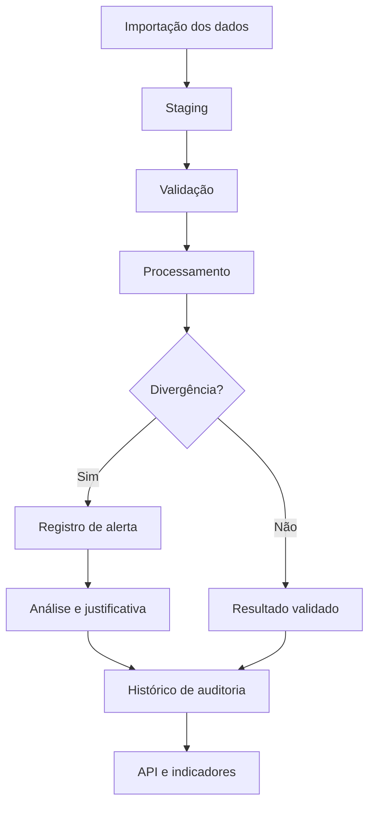

# ⚡ Plataforma de Auditoria Energética


**Status: em desenvolvimento**

Projeto de uma plataforma para automatizar a auditoria de dados energéticos, identificar divergências e garantir a rastreabilidade das informações.

A solução combina desenvolvimento back-end, processamento de dados e regras de negócio para transformar processos manuais em fluxos automatizados e auditáveis.

---

## 🎯 Objetivo

Desenvolver uma aplicação capaz de:

- Importar dados energéticos de diferentes fontes.
- Validar a integridade e a consistência das informações.
- Identificar divergências de consumo e faturamento.
- Aplicar regras de auditoria configuráveis.
- Registrar intervenções e justificativas.
- Manter um histórico de processamento e alterações.
- Disponibilizar os resultados por meio de uma API.

## 🛠️ Tecnologias

| Tecnologia | Aplicação |
|---|---|
| Python | Processamento e regras de negócio |
| FastAPI | Desenvolvimento da API REST |
| PostgreSQL | Armazenamento dos dados |
| SQLAlchemy | Mapeamento e persistência |
| Alembic | Migrações do banco de dados |
| Pytest | Testes automatizados |

## 🏗️ Arquitetura planejada

A aplicação será organizada em camadas:

1. **Ingestão:** recebimento e importação dos dados.
2. **Staging:** armazenamento e validação inicial.
3. **Processamento:** aplicação das regras de auditoria.
4. **Intervenção:** registro de justificativas e correções.
5. **Qualidade:** identificação de inconsistências.
6. **Auditoria:** rastreabilidade e histórico das operações.
7. **API:** disponibilização dos dados processados.

## 📂 Estrutura planejada

```text
energy-audit/
├── app/
│   ├── api/
│   ├── core/
│   ├── models/
│   ├── schemas/
│   ├── services/
│   └── main.py
├── alembic/
├── tests/
├── sample_data/
├── docs/
├── requirements.txt
├── .env.example
└── README.md
```

## 🔄 Fluxo de processamento



## 🚀 Roadmap

- [ ] Publicar a estrutura inicial do projeto
- [ ] Configurar PostgreSQL e migrações
- [ ] Implementar importação de dados
- [ ] Desenvolver regras de validação
- [ ] Criar os endpoints da API
- [ ] Implementar os registros de auditoria
- [ ] Adicionar testes automatizados
- [ ] Disponibilizar uma demonstração

## 🔐 Segurança dos dados

Este portfólio será desenvolvido como uma implementação independente, utilizando dados sintéticos.

Nenhum dado pessoal, credencial ou código proprietário será incluído neste repositório.

---

**Desenvolvido por [Saskia Luz](https://github.com/saskialuz)**

[LinkedIn](https://www.linkedin.com/in/saskialuz)
  
